<h1 align="center">
  <br>
  E-banking
<br>
</h1>

<h4 align="center">An Online bank web application built on top of <a href="https://nodejs.org/en/" target="_blank">NodeJS</a> by Team4.</h4>

<p align="center">
 <a href="#deployed-version">Demo</a> •
  <a href="#key-features">Key Features</a> •
  <a href="#demonstration">Demonstration</a> •
  <a href="#build-with">Build With</a> •
  <a href="#installation">Installation</a> • 
  <a href="#future-updates">Future Updates</a> • 
</p>
<br>

## Deployed Version

Live demo 👉 : https://team4-ebanking.netlify.app/

Access Admin Dashboard by login in with admin account 👉 :\
Email: team4fwd@gmail.com\
password : admin@123

## Key Features

- Authentication and Authorization
  - Login, Signup and logout.
- Verifying users
  - Admin can see and accept/reject registration requests so that the user can log-in and use the system.
- user details
  - Admin can see the register and user so that he can take actions on them like activate or deactivate users.
- Create Accounts
  - Active users can create Accounts with init amount so that they can use it to transfer money.
- Approve account
  - Admin can list and see new Accounts requests and take action on it.
- withdraw/recharging
  - Active users can withdraw or recharge account by entering the amount they want to use.
- Transfer money
  - Active users can send money from activated account by entering the amount they want to use and destination account number.
- Transactions Log
  - Active users can see and list transactions log throw all my account And filter in it by account
- Suspend admin
  - Admin can activate or suspend user so the user can't login to the system.

## Demonstration

#### User Home Page :

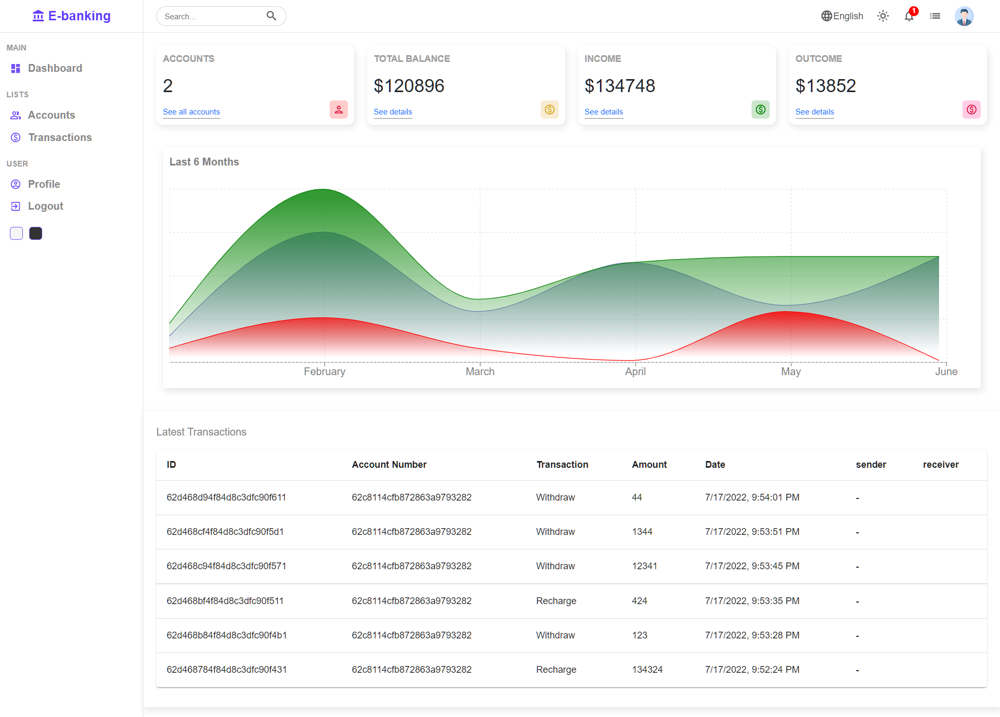

#### User Home Page (dark mode) :

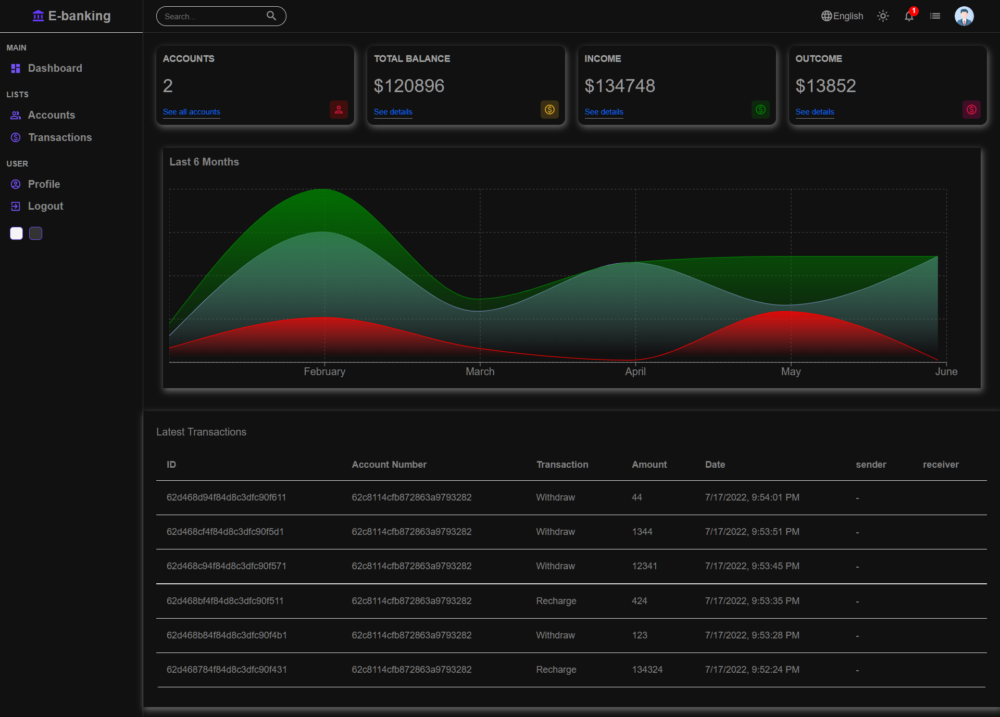

#### Accounts Page :

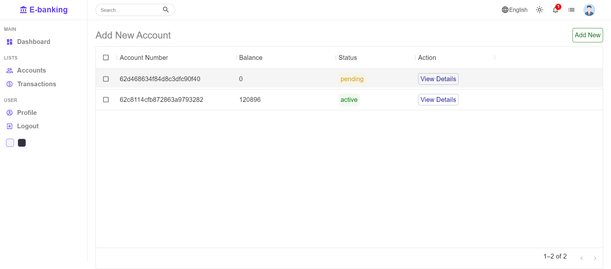

#### Add Accounts Page :

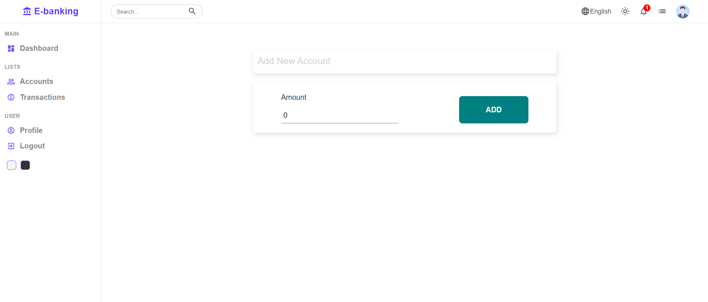

#### Account Details Page :

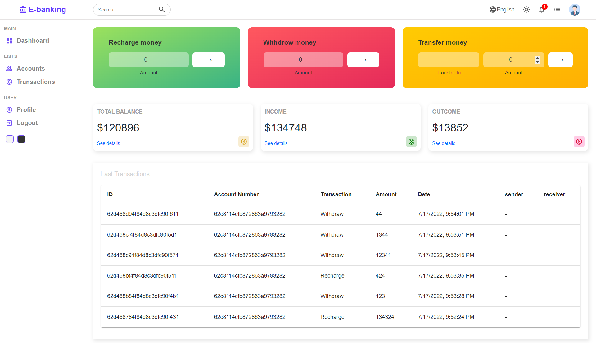

#### Profile Page :

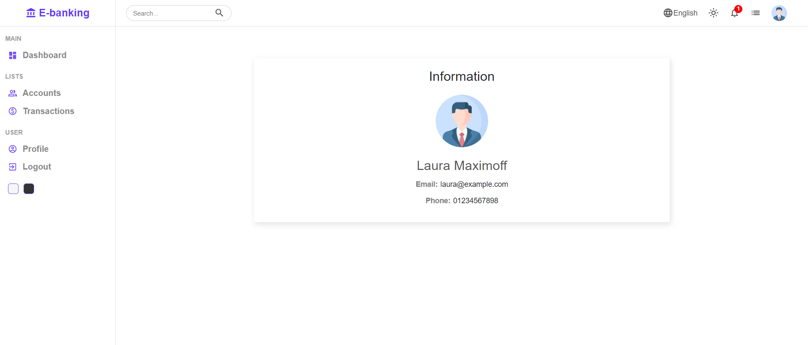

#### Login Page :

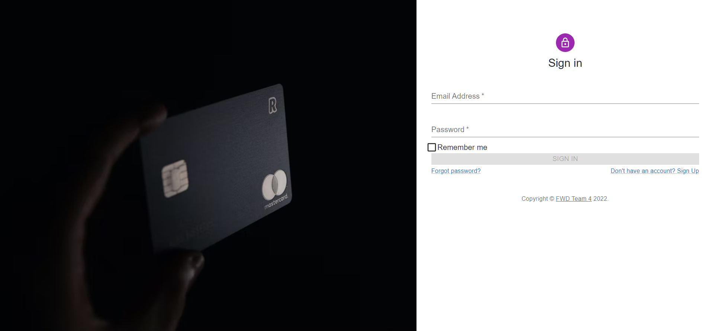

#### Signup Page :

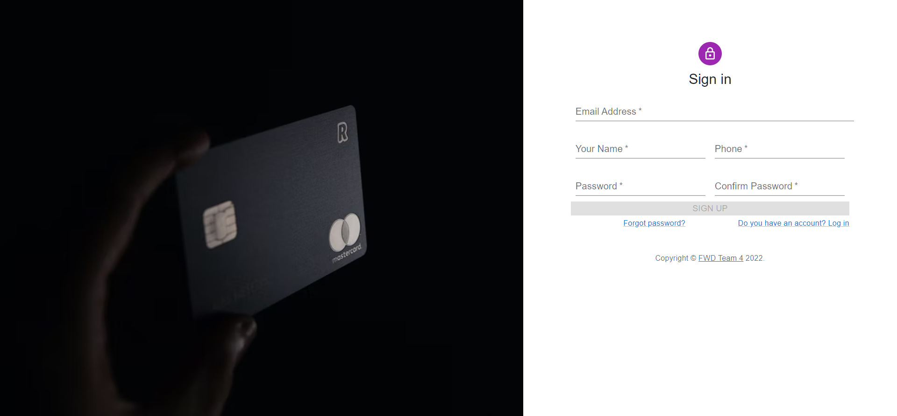

#### Admin Dashboard Page :

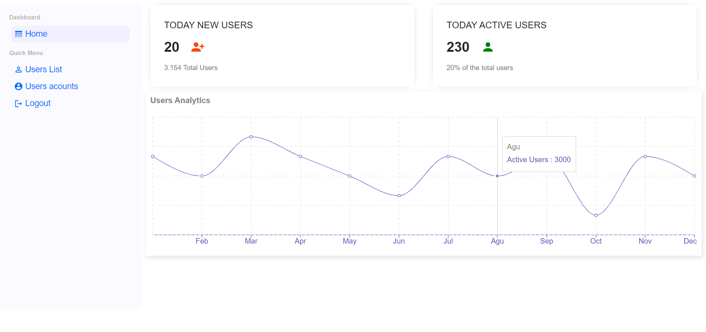

#### Admin Users List Page :

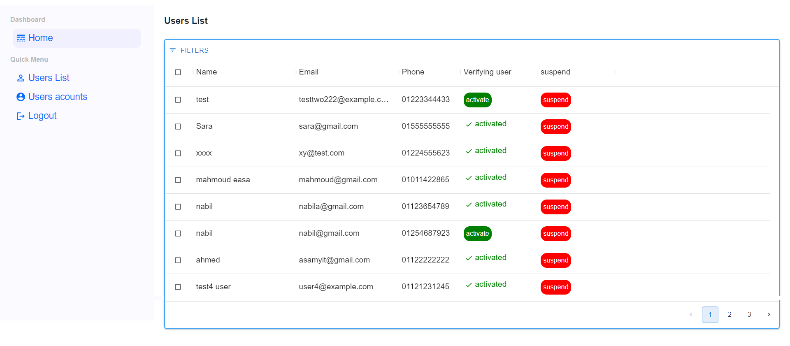

#### Admin Accounts List Page :

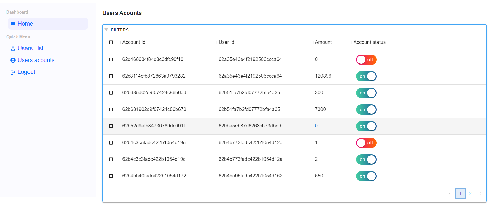

## Build With

- [NodeJS](https://nodejs.org/en/) - JS runtime environment
- [Express](http://expressjs.com/) - The web framework used
- [Mongoose](https://mongoosejs.com/) - Object Data Modelling (ODM) library
- [MongoDB Atlas](https://www.mongodb.com/cloud/atlas) - Cloud database service
- [React](https://reactjs.org/) - A JavaScript library for building user interfaces
- [JSON Web Token](https://jwt.io/) - Security token
- [Postman](https://www.getpostman.com/) - API testing

## Libraries

- BackEnd

  - Node js
  - mongoose
  - express
  - crypto
  - dotenv
  - express-fileupload
  - helmet
  - nodemailer
  - cloudinary
  - joi
  - jsonwebtoken

- FrontEnd
  - React
  - Redux
  - bootstrap
  - MUI
  - axios
  - formik
  - recharts

## Installation

You can fork the app or you can git-clone the app into your local machine. Once done that, please install all the
dependencies by running

```
run node app
$ cd Client
$ npm i
$ npm start
on another termenal
$ cd server
$ npm i
set your env variables
$ npm start
```

## Future Updates

- Improve overall UX/UI and fix bugs with responsiveness
- And More ! There's always room for improvement!
